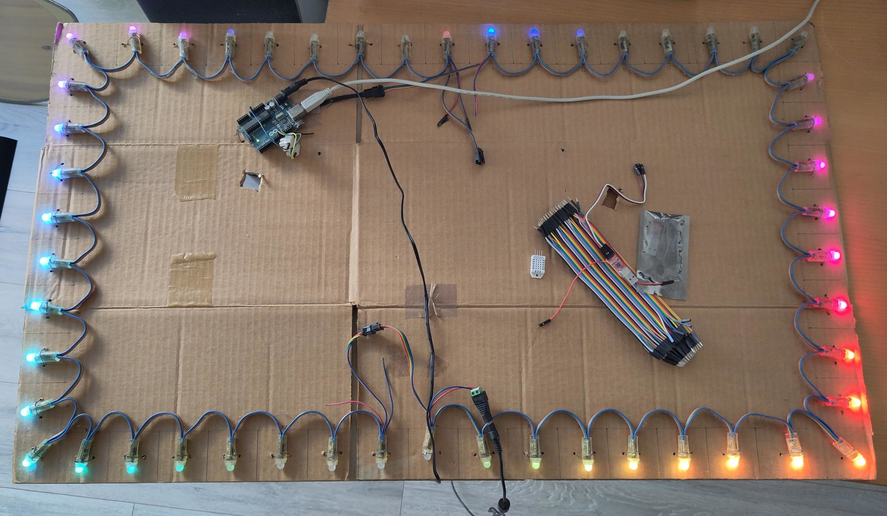
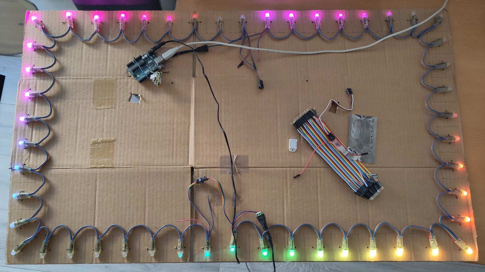
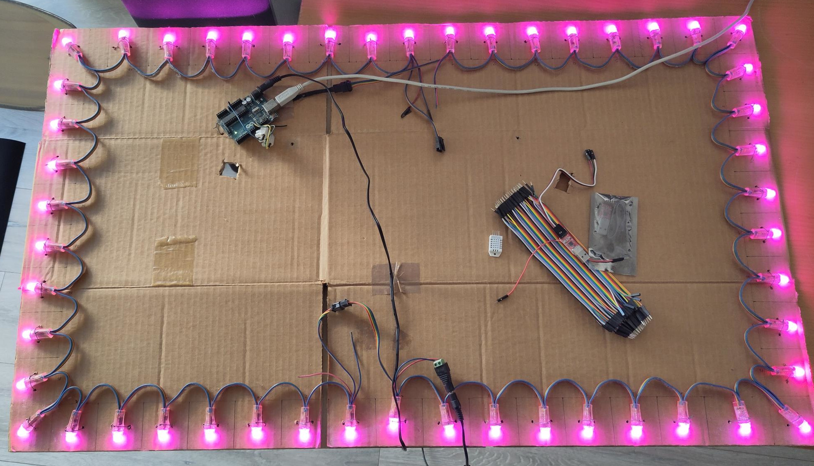
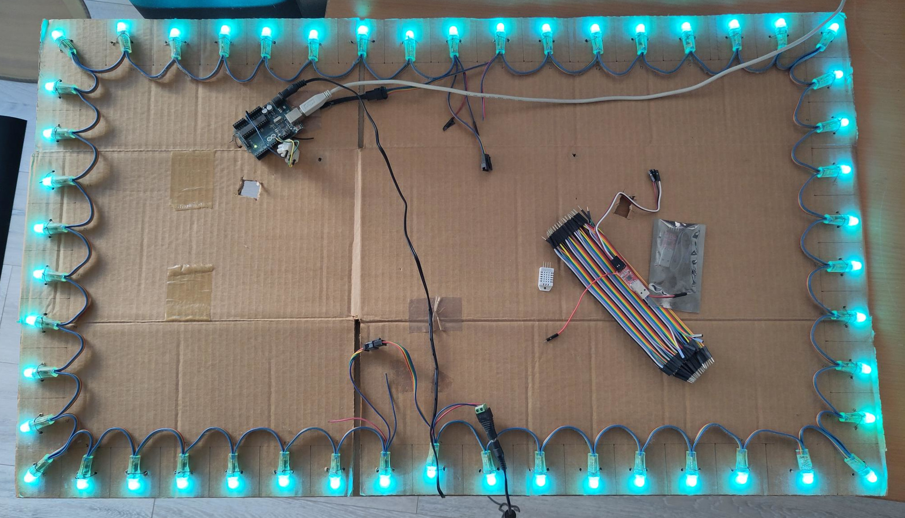
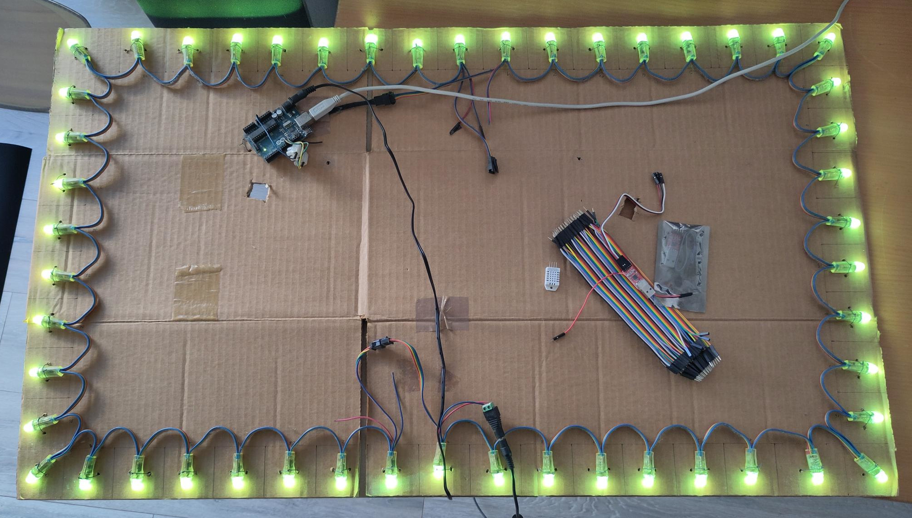
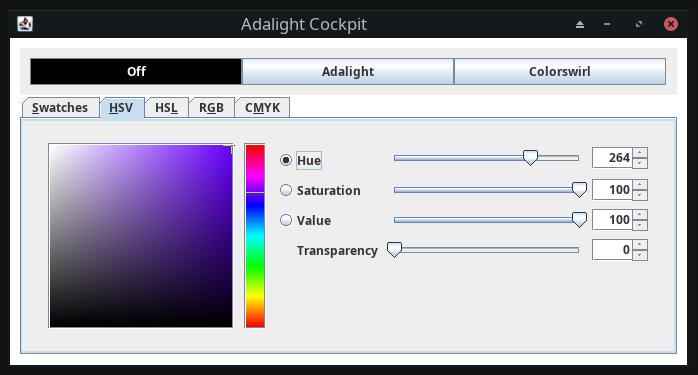

# AdalightCockpit

| | |
|---:|:---|
|  |  |
|  |  |
|  |  |

Small Java control panel (cockpit) for my Adalight.

It's an old personal project.  
It works but it's not exceptionally pretty :)

Currently It's only usage ready for Linux.  
If someone is interested in a Windows / Mac version - tell me  
(best via a Github issue).

The idea for the Adalight and most of the software is from:  
https://www.adafruit.com  
(awesome site - check them out).

Their tutorial for the Adalight is here:  
https://learn.adafruit.com/adalight-diy-ambient-tv-lighting  
All credit goes to them!

This uses:
- org.processing.Core
- com.fazecast.jSerialComm

<!--
TODOS
- needs to access /dev/ttyACM0 etc. think about group etc.
- better healthchecks for device not found
- adalight can only be activated after single color
- should start in adalight
- maybe go to java fx?
-->